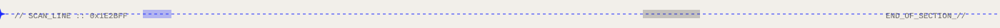

<!-- ============ HERO BANNER ============ -->
<p align="center">
  
</p>

<!-- ============ TYPING TAGLINE ============ -->
<p align="center">
  
</p>

<p align="center">
  
  
  
</p>

---

<!-- ============ ABOUT ============ -->
### `[ + ]` ABOUT.ME

```yaml
name      : Avocado
role      : Technical Artist / Plugin Developer
engines   : [ Unity, Unreal Engine 5 ]
focus     : [ Shader, Editor Tooling, Rendering Pipeline, DCC Bridge ]
learning  : [ HLSL, URP/HDRP source, Niagara, Nanite, Lumen ]
mantra    : "好的工具能让美术和程序都少加一小时班。"
contact   : avocado15001799459@163.com
```

---

<!-- ============ TECH STACK : POSTER GRID ============ -->
### `[ * ]` TECH.STACK

<table>
  <tr>
    <td align="center" width="25%" bgcolor="#1E2BFF">
      
    </td>
    <td align="center" width="25%">
      
    </td>
    <td align="center" width="25%">
      
    </td>
    <td align="center" width="25%">
      
    </td>
  </tr>
  <tr>
    <td align="center"></td>
    <td align="center"></td>
    <td align="center"></td>
    <td align="center"></td>
  </tr>
  <tr>
    <td align="center"></td>
    <td align="center"></td>
    <td align="center"></td>
    <td align="center"></td>
  </tr>
</table>

---

<!-- ============ ANIMATED SHADER DIVIDER ============ -->
<p align="center">
  
</p>

### `[ # ]` WHAT.I.BUILD

| `MODULE` | `DESCRIPTION` |
|:---|:---|
| **​`editor.extensions`​** | Unity Inspector / EditorWindow · UE Slate & Editor Utility Widget |
| **​`rendering.plugins`​** | SRP 自定义 Pass · UE RDG / Render Feature · Custom RenderPass |
| **​`shader.libraries`​** | 卡通渲染 · PBR 扩展 · 屏幕后处理 · 特效 Shader |
| **​`pipeline.tools`​** | 资源批处理 · 自动化导入 · DCC ↔ Engine 数据桥接 |
| **​`upm.packages`​** | 可复用、可发行的模块化工具集 |

---

<!-- ============ STATS : MATCHING THEME ============ -->
### `[ % ]` GITHUB.STATS

<p align="center">
  
  
</p>

<p align="center">
  
</p>

<p align="center">
  
</p>

<!-- ============ CONTRIBUTION SNAKE (动态像素故障) ============ -->
<p align="center">
  
</p>

---

### `[ @ ]` CONNECT

<p align="left">
  <a href="mailto:avocado15001799459@163.com"></a>
  <a href="https://github.com/avocadomisstvt"></a>
</p>

<p align="center">
  <sub><code>53.7346°N, 10.1648°E  //  78.6518°N, 16.4017°E  //  59.9886°N, 6.2643°E</code></sub><br/>
  <sub><b>{ XML }.CHESS — @.ExplTion : DATA 80% : BIOLOGICAL 20%</b></sub>
</p>
