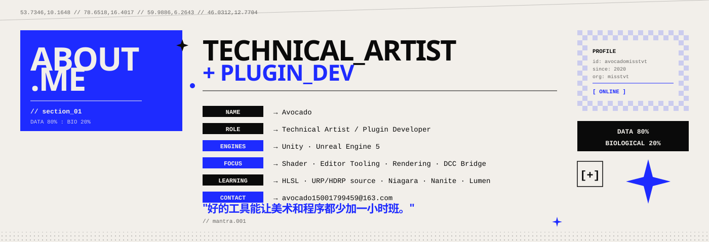
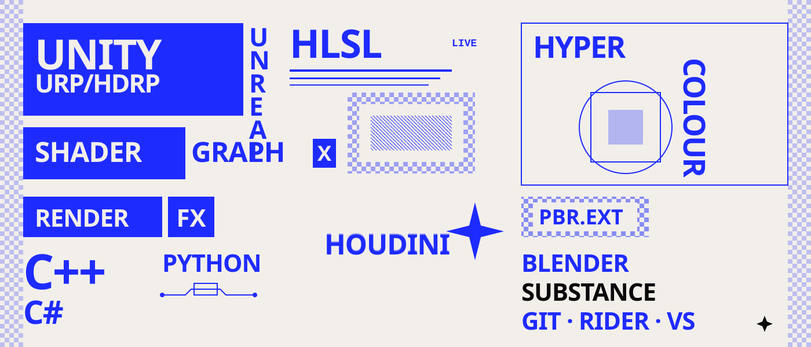
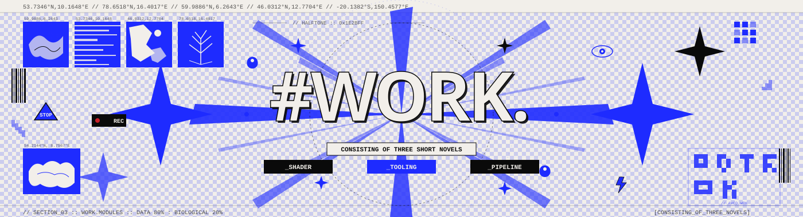
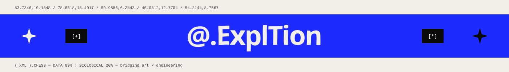

<!-- ============================================================
     AVOCADO · TECHNICAL ARTIST  ::  README.md
     style: cyber-editorial / techno-poster / blue×ivory×black
============================================================ -->

   

 

 

<!-- ====== ABOUT (整张海报式 SVG，已去掉原 yaml 块) ====== -->

 

 

## `[ * ]` TECH.STACK

 

 

## `[ # ]` WHAT.I.BUILD

| `MODULE` | `DESCRIPTION` |
|:---|:---|
| **​`editor.extensions`​** | Unity Inspector / EditorWindow · UE Slate & Editor Utility Widget |
| **​`rendering.plugins`​** | SRP 自定义 Pass · UE RDG / Render Feature · Custom RenderPass |
| **​`shader.libraries`​** | 卡通渲染 · PBR 扩展 · 屏幕后处理 · 特效 Shader |
| **​`pipeline.tools`​**    | 资源批处理 · 自动化导入 · DCC ↔ Engine 数据桥接 |
| **​`upm.packages`​**      | 可复用、可发行的模块化工具集 |

 

 

## `[ % ]` GITHUB.STATS

 

 

 

## `[ @ ]` CONNECT

 

